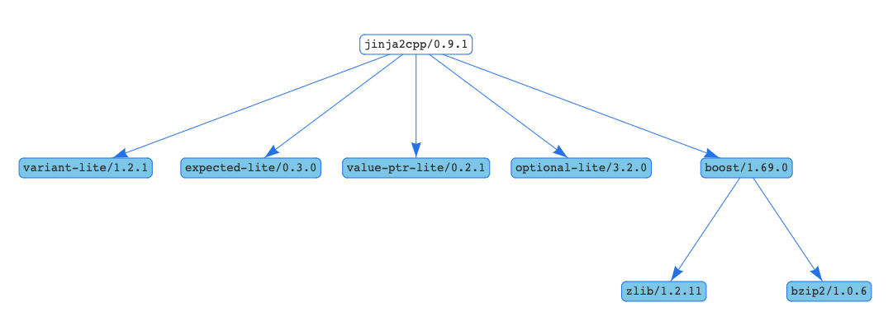

# Jinja2Cpp-conan

[Conan](https://conan.io) package recipe for [Jinja2Cpp](https://github.com/jinja2cpp/Jinja2Cpp) library.



## Usage

Once you have [Conan](https://conan.io/downloads.html) you will need to configure
the required remotes to use this package because not all the packages are in the
conan-center repository:

```bash
conan remote add martinmoene https://api.bintray.com/conan/martinmoene/nonstd-lite
conan remote add flexferrum https://api.bintray.com/conan/flexferrum/conan-packages
```

To use this package in your project with CMake it is enough to write a single
`conanfile.txt` file:

```ini
[requires]
jinja2cpp/1.0.0@flexferrum/testing

[generators]
cmake_find_package
```

You won't need to modify your `CMakeLists.txt`:

```cmake
cmake_minimum_required(VERSION 2.8.0)
project(MyProject)

set(CMAKE_CXX_STANDARD 14)

find_package(jinja2cpp REQUIRED)

add_executable(executable main.cpp)
target_link_libraries(executable PRIVATE jinja2cpp::jinja2cpp)
```

Given these two files in the root of your project, and the sources `main.cpp`,
you can build your project and start using **Jinja2Cpp** as usual:

```sh
$> conan install .
$> mkdir build && cd build
$> cmake ..
$> cmake --build .
$> ./executable
```
